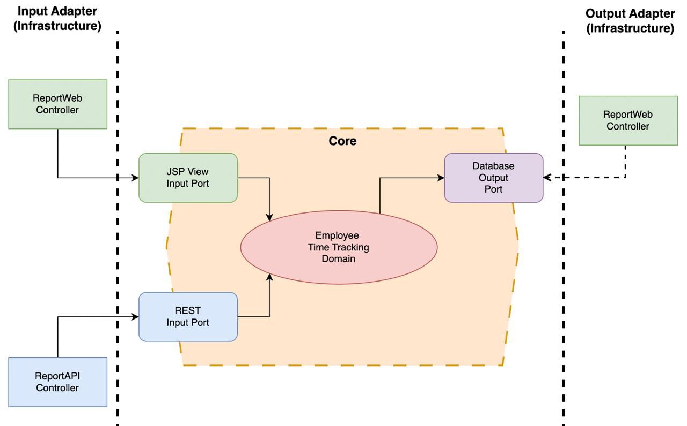

# Employee Time Tracking Service (`emp_time_tracking_svc`)

This service is designed to track and report employee work hours across projects within a selectable date range.

## Features

1. **Dynamic Report Generation**
   - Generate reports showing total work hours per employee and project within a specified date range.
   - Supports pagination for large datasets.
   - Reports can be accessed through either a web interface or a RESTful API.
2. **User Authentication**
   - Secure login/logout functionality to authenticate user using Spring Security. 
3. **Role-Based Access Control (RBAC)**
   - ***User Authorization*** to restrict access to certain endpoints based on user roles.
   - Admins (`ROLE_ADMIN`) can view all employees, while employees (`ROLE_EMPLOYEE`) can view only their own work hours.

## Technologies Used

1. **Backend**
   - Java 21
       - Why Java 21 ?
           - The most recent LTS version, ensuring long-term stability, security updates, and community support.
           - Performance improvements: Java 21 introduces significant performance enhancements, including the use of new features like non-blocking I/O and the new String API, resulting in faster execution and improved scalability.
           - Java 21 includes critical security patches and improvements.
   - SpringBoot 3
       - Provides rapid application development with minimal configuration.
       - Spring Boot 3 is the most recent version of Spring Boot, I want to be sure to always use the latest version.
   - Spring Web
   - Spring Data JPA
       - I prefer JPA over JDBC as it abstracts the persistence layer (the underlying database technology) from the application layer.
   - Spring Security
       - A de-facto authentication and authorization framework for Spring applications.
2. **Frontend**
   - Thymeleaf
       - I intentionally replace JSP with Thymeleaf since it's a more modern alternative, especially since the version of SpringBoot 3 (Spring 6+) which doesn't require for extra configuration to make it run. 
   - Bootstrap
3. **Database**
   - PostgreSQL
4. **Build Tool**
   - Maven

## Project Structure

The application follows the ***Hexagonal Architecture** which similar to other architectures like **Clean Architecture** or **Onion Architecture**.
The main reason for me to choose this architecture is that it allows us to separate the core business logic from its application interface. 
Hence it we can protect our business logic within the core domain layer regardless of its application interface or any infrastructure layer 
such as database, framework, etc that we're going to embrace. 
As what I've done here in this project where I have provided a web interface and a REST API within its infrastructure application layer to interact with our user/client.
I have also used few terminology from Domain Driven Design (DDD) such as *Domain Entity*, *Domain Service*, *Value Object (VO)*, etc that I personally adjust to the context of this project.
Further reading about these architectural patterns can be found from [my blog post series here](https://blog.yauritux.link/ddd-part-i-introduction-cabab1d2e27d).

Following is the project structure:
1. **Core Layer**, this is the core business layer that is supposed to be independent of any application interface or infrastructure layer. It has the following sub-packages:
   - **domain**, contains:
       - **entity**, represents our business domain model, e.g., `Employee`, `Project`, `TimeRecord`.
       - **dto**, represents our data transfer object which basically is merely a data container that we normally use to transfer the object between layers and tiers in a single application or between application to application, e.g., `EmployeeTimeTrackingReportDTO`.
       - **vo**, represents our value object which also another type of DTO, yet here we use it to wrap our constants, e.g., `UserRole`.
       - **servide**, represents our business domain service (related to application services / use cases). Here, we take it forward by having a clear separation between command and query service.
   - **port**, which basically is our interface to the outside world or the client. We use port to connect our core domain with the infrastructure layer. This layer has the following sub-packages:
       - **input**, which is the primary interface that is used to receive any request from the client's infrastructure.
       - **output**, which is the secondary interface to the outside world or the client, such as writing into a database, calling an external API, etc.
2. **Adapter Layer**, this is the layer that represents our infrastructure layer such as frameworks, databases, client user applications, etc. It has the following sub-packages:
   - **config**, contains the configuration for the application related to frameworks, databases, etc.
   - **annotation**, contains the annotation (middleware interceptor, pre-processor, post-processor, etc) for the application related to frameworks, databases, etc.
   - **input**, the input adapter that is used to receive any request from the clients.
   - **output**, the output adapter that is used to write into a database, file, service, standard-output stream, etc.



## Setup Instructions

### Prerequisites

1. Docker
2. Docker compose

### Steps

1. Clone the repository.
   ```shell
   git clone https://github.com/yauritux/xphr-tht.git
   ```
2. Go to the project root directory.
   ```shell
   cd xphr-tht/part-2
   ```
3. Rename .env.example to .env and adjust the value as necessary.
   ```shell
   mv -v .env.example .env
   ```
4. Run docker compose.
   ```shell
   docker compose up -d --build
   ```

### Usage

1. **Login**
   - Navigate to the application by visiting `http://localhost:9000/login` in your web browser.
   - Use the following credentials:
       - **ROLE_ADMIN** (username: `admin`, password: `admin123`)
       - **ROLE_EMPLOYEE** (username: `yauri`, password: `yauri123` ***OR*** username: `jacky`, password: `jacky123`)
2. **Generate Report**
   - Select a date range and click the "Generate Report" button.
   - The report will display total work hours per employee and project.
3. **Pagination**
   - Use the pagination controls at the bottom of the report table to navigate between pages.
4. **API Docs**
   - Navigate to `http://localhost:9000/swagger-ui/index.html` in your web browser.
5. **Logout**
   - Click the "Logout" button in the top-right corner of the page.

## Contact

- Name: M. Yauri M. Attamimi
- Email: [yaurigneel@gmail.com](mailto:yaurigneel@gmail.com)
- Website: [yauritux.link](https://yauritux.link)
- GitHub: [github.com/yauritux](https://github.com/yauritux)

